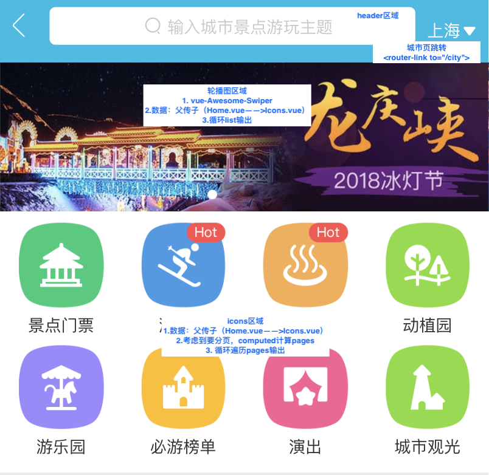
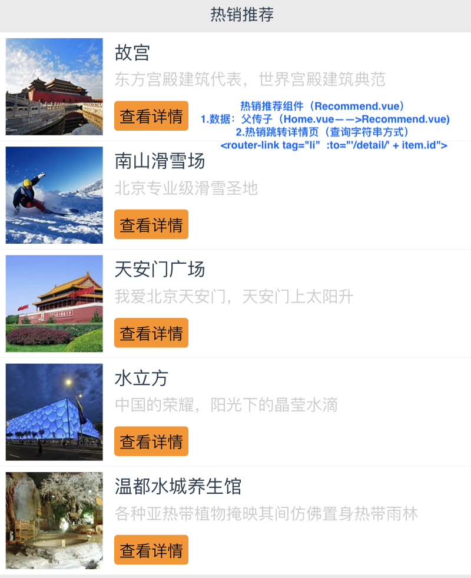
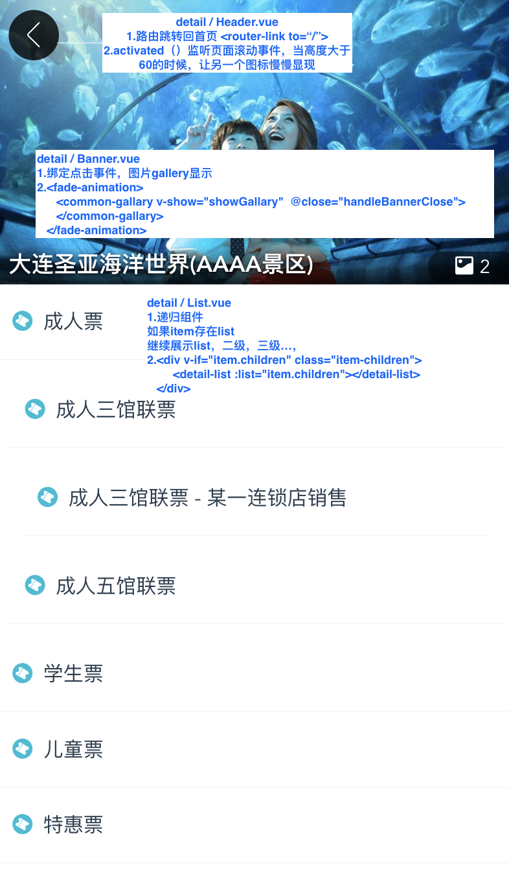
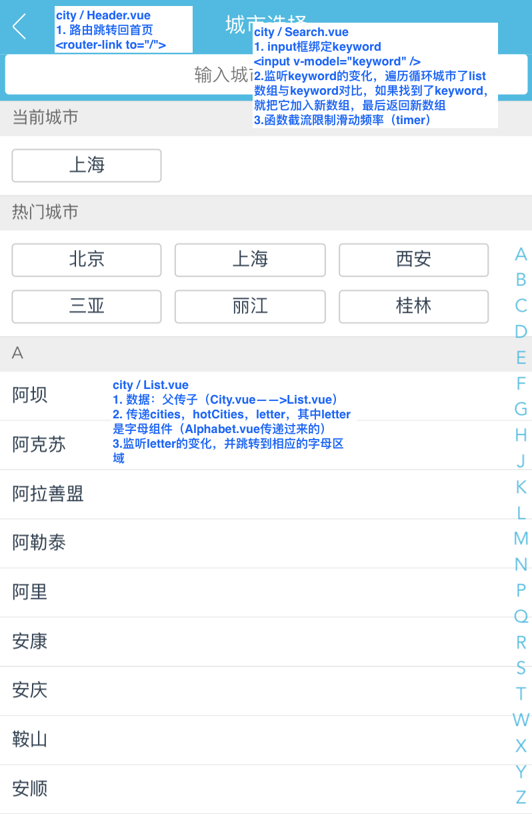
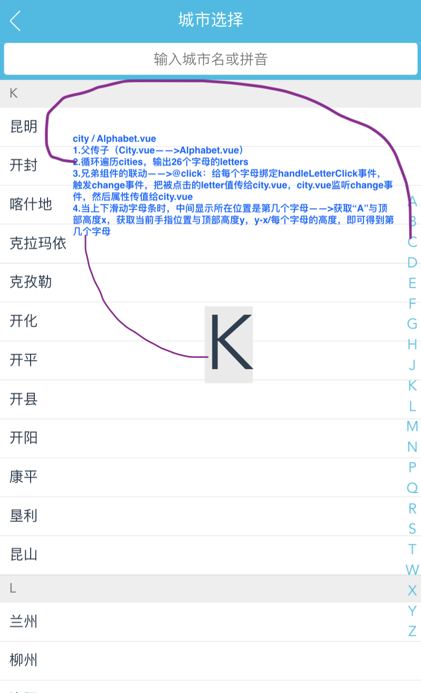
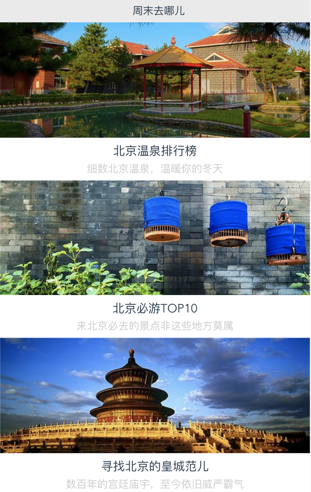

# 仿去哪儿网景点页面和城市页面（travel）

## 启动
### 1.命令行
```npm run dev```

## 技术栈

- vue
- vue-awesome-swiper——轮播插件

- vue-router——路由插件
- vuex——数据共享
- axios——发请求
- apache——web服务器

## 实现功能

- Ajax获取首页数据——axios实现
- 城市页，景点页路由跳转
- 实现城市页搜索功能
- 兄弟组件间的联动
  - 字母表与城市页（Alphabet.vue 和 List.vue）
  - 滚动字幕表，及滚动List城市

- vuex实现数据共享
  - 景点页城市页数据传输

## 路由设计

|          |             |          |           |              |
| -------- | ----------- | -------- | --------- | ------------ |
| 请求方法 | 请求路径    | get 参数 | post 参数 | 备注         |
| GET      | /           |          |           | 渲染首页     |
| GET      | /city       |          |           | 渲染城市页面 |
| GET      | /detail/:id | id       |           | 渲染详情页   |

## 项目截图

- #### 轮播图和icons组件




- #### 热销推荐组件


- #### 热销详情页


- #### 城市页


- #### 城市页字母条


- #### 周末去哪儿组件
